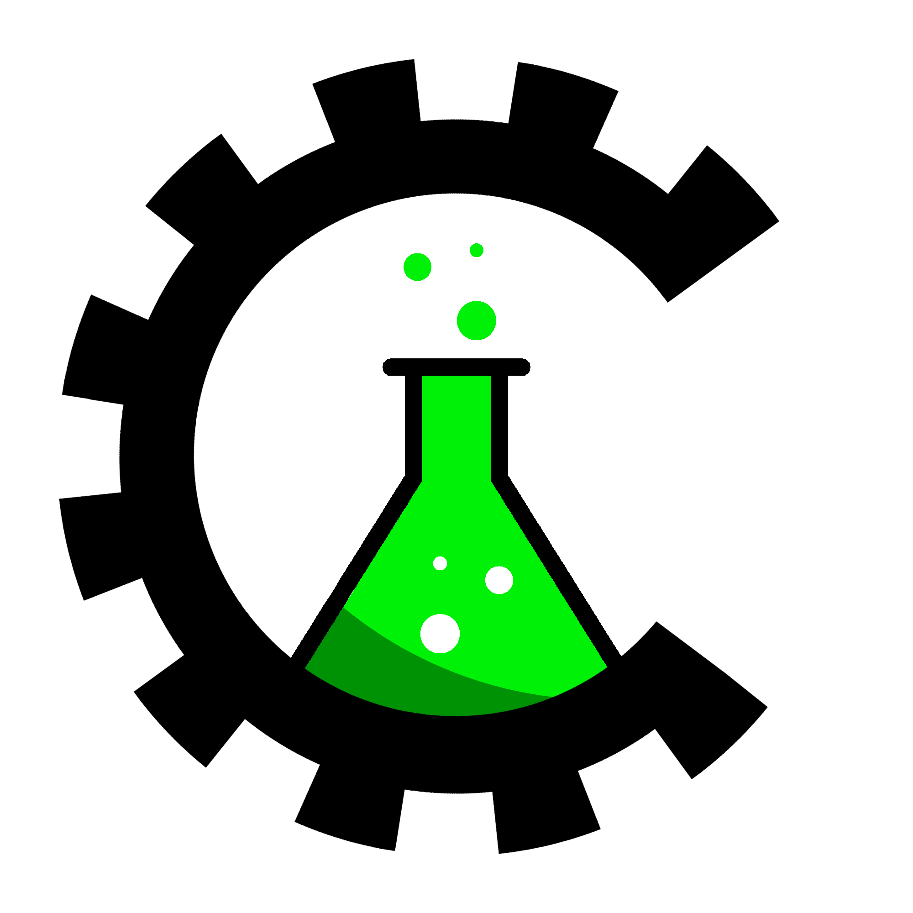

<p align="center">
    
</p>
<h1 align="center"><b>Catalyzer</b></h1>
<p align="center">Catalyzer is a web framework for Rust, made to be simple and easy to use.</p>
<div align="center">
    <a href="https://www.github.com/AtomicGamer9523/Catalyzer">
        
    </a>
    <a href="https://www.github.com/AtomicGamer9523">
        
    </a>
</div>


## Example

```rust
use catalyzer::*;

#[main]
fn main() {
    App![index]
        .bind("0.0.0.0:3000")?
        .launch()
}

#[get("/")]
fn index() {
    "Hello, World!"
}
```
